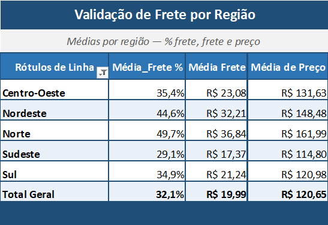

# Análise Operacional no E-commerce Olist

> **Onde a operação da Olist perde valor:** como o atraso na entrega derruba a
> satisfação do cliente, e onde o frete pesa mais na conta por região.
> Tudo medido sobre dado real! Sem premissa de custo inventada.

---

## 🎯 Tese

A saúde de um marketplace não vaza só pela margem, ela vaza pela experiência.
Este projeto investiga duas alavancas **medíveis** dessa perda, sobre ~100 mil
pedidos reais da Olist (2016–2018):

- **Tese principal —** o atraso na entrega (e, mais a fundo, o tempo *absoluto*
  de espera) derruba a satisfação do cliente.
- **Camada de apoio —** o peso do frete por região, que corrói a economia do
  pedido justamente onde a distância é maior.

Sem COGS, sem margem estimada: cada número aqui nasce de dado medido. É de
propósito — o projeto se sustenta sem nenhuma premissa de custo inventada.

## 📌 Principais achados

1. **Pontualidade é piso, não diferencial.** A nota média cai de forma contínua
   de **4,29** (no prazo) para **1,7** (atraso grave, +7 dias). Bastam **1 a 3 dias**
   de atraso para perder ~1 ponto inteiro de avaliação.
   -> *E daí:* cada dia de atraso tem custo de reputação mensurável, o prazo de
   entrega é alavanca direta de satisfação, não um detalhe operacional.

2. **O prazo prometido folgado esconde a lentidão real.** Norte e Nordeste entregam
   *antes* do prazo e ainda assim têm as piores notas (**4,03** e **3,97**). O que
   derruba não é o atraso, é o tempo absoluto de espera. Onde o Norte espera **22,5 dias**
   contra **10,7** do Sudeste.
   -> *E daí:* o problema é estrutural (vendedores concentrados no Sudeste), não um
   atraso pontual. Uma estimativa de prazo folgada mascara o sintoma.

3. **O frete pesa quase o dobro nas regiões mais distantes.** No Norte o frete
   representa **49,7%** do preço médio do item, contra **29,1%** no Sudeste 
   cerca de **1,7x**. As regiões que mais esperam são as que mais pagam frete e
   as menos satisfeitas.
   -> *E daí:* tempo, frete e nota andam juntos — correlação forte e consistente,
   sem isolar o frete como causa única.

## 💡 Recomendações estratégicas

Os achados acima viram ação em [`docs/recomendacoes.md`](docs/recomendacoes.md),
onde cada recomendação segue o formato **problema -> hipótese -> ação -> métrica de
sucesso**, ancorada apenas no que o dado medido sustenta. Em resumo:

1. **Trocar o KPI de logística** Medir tempo absoluto de entrega, não só "% no prazo"
   (que mascara a lentidão das regiões de prazo folgado).
2. **Tratar pontualidade como piso** Atacar o atraso desde o 1º dia, com gatilho para
   os ~6,77% de pedidos em risco (pouco volume, muito impacto na nota).
3. **Aproximar a oferta das regiões distantes** Sellers/CD regionais atacam tempo *e*
   frete na raiz (a aposta estrutural; validar por piloto).
4. **Frete como alavanca de curto prazo** Política de frete segmentada onde ele mais
   pesa (com o limite explícito de que falta dado de custo para dimensionar o retorno).

## 📊 Dashboard (Power BI)

O dashboard foi construído em Power BI sobre as duas views do projeto, em um
star schema com `dim_regiao` no centro. O modelo, as medidas DAX e as decisões
de construção estão documentados em
[`docs/dashboard_powerbi.md`](docs/dashboard_powerbi.md).

📄 **[Ver o dashboard completo em PDF](assets/diagnostico-operacional-olist.pdf)**

## ✅ Validação cruzada

Cada número-chave foi recalculado de forma independente no **Excel**, a partir dos
mesmos dados brutos, para confirmar que a query SQL e a planilha chegam ao mesmo
resultado. O peso do frete por região é o exemplo — SQL e Excel batem em todas as
regiões:



> A tabela dinâmica do Excel reproduz os mesmos percentuais, validando a query de
> forma independente.

## 🗂️ Sobre os dados

Dataset público **Brazilian E-Commerce Public Dataset by Olist** — ~100 mil pedidos
reais feitos na Olist Store entre 2016 e 2018, anonimizados. Modelo relacional de
9 tabelas (pedidos, itens, produtos, clientes, vendedores, pagamentos, avaliações,
geolocalização e tradução de categorias).

Fonte: [Kaggle — Brazilian E-Commerce Public Dataset by Olist](https://www.kaggle.com/datasets/olistbr/brazilian-ecommerce).

> ℹ️ Os CSVs originais **não são versionados** (ver `.gitignore`). Para reproduzir,
> baixe-os do Kaggle e siga as instruções abaixo.

## 🛠️ Stack

| Etapa | Ferramenta |
|---|---|
| Armazenamento e carga | PostgreSQL |
| Análise e queries | SQL |
| Validação cruzada | Excel |
| Visualização e storytelling | Power BI |
| Versionamento e documentação | Git + GitHub |

## 📁 Estrutura do repositório

```
.
├── assets/
│   ├── diagnostico-operacional-olist.pdf   # dashboard exportado (Power BI)
│   └── validacao_frete_por_regiao.png      # print da validação cruzada (Excel)
├── docs/
│   ├── analise_sql.md                      # narrativa da investigação SQL
│   ├── dashboard_powerbi.md                # modelo, medidas DAX e processo do Power BI
│   └── recomendacoes.md                    # recomendações estratégicas
├── sql/
│   ├── README.md                           # índice e ordem de execução dos scripts
│   ├── 01_criacao_tabelas.sql              # cria as 9 tabelas do dataset
│   ├── 02_importacoes.sql                  # carga via COPY nativo do PostgreSQL
│   ├── 03_chaves_indices.sql               # PKs e índices pós-carga
│   ├── 04_dimensao_regioes.sql             # de/para UF → região do Brasil
│   └── analises/
│       ├── atraso_entrega_satisfacao.sql   # tese principal
│       ├── atraso_por_estado.sql           # quebra por UF
│       ├── atraso_por_regiao.sql           # agregação por região
│       ├── tempo_entrega_por_regiao.sql    # tempo absoluto × nota
│       ├── frete_por_regiao.sql            # peso do frete por região
│       └── views/
│           ├── vw_pedido_analise.sql       # grão de pedido (fonte da página 1)
│           └── vw_item_frete.sql           # grão de item (fonte da página 2)
└── README.md
```

## ▶️ Como reproduzir

1. Baixe os dados do Kaggle (link acima) e coloque os CSVs numa pasta local.
2. Crie o banco no PostgreSQL e rode os scripts de `sql/` na ordem numérica
   (ajuste os caminhos do `02_importacoes.sql` para a sua pasta de CSVs).
   Veja `sql/README.md` para a ordem de execução e o que cada script prova.
3. Rode as queries de `sql/analises/` para reproduzir cada achado e crie as
   views de `sql/analises/views/`.
4. O dashboard foi construído em Power BI sobre essas duas views. O modelo, as
   medidas DAX e as decisões de construção estão em `docs/dashboard_powerbi.md`.

---

## 👤 Autor

**Lucas Fontes**

[LinkedIn](https://www.linkedin.com/in/lucassfontesc/) · fonteslucas678@gmaill.com

<sub>Projeto de portfólio em Análise de Dados.</sub>
